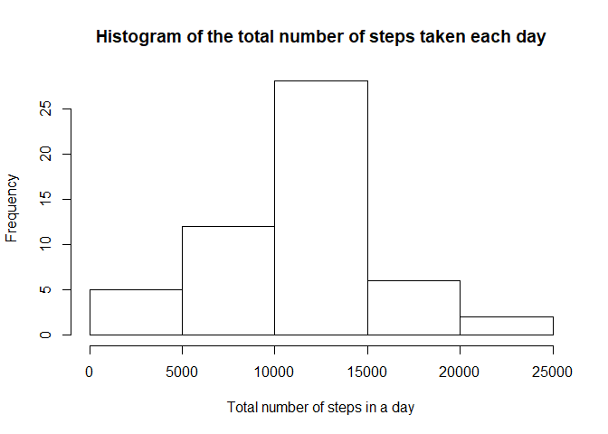
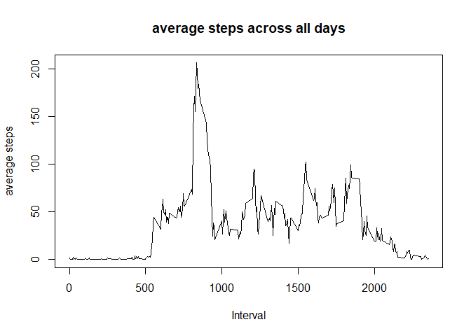
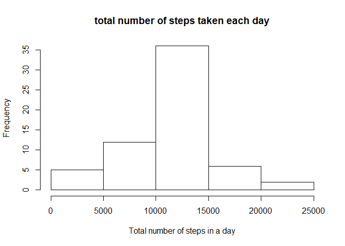
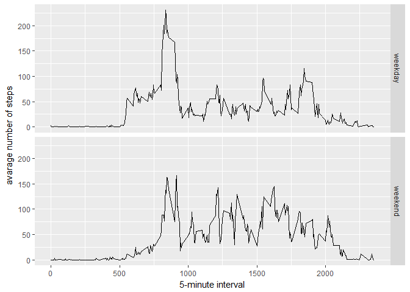

```r
knitr::opts_chunk$set(echo = TRUE)
library(knitr)
library(dplyr)
```

## Loading and preprocessing the data

1. Load the data

```r
data <- read.csv("activity.csv")
```

2. Process/transform the data (if necessary) into a format suitable for your analysis

```r
act <- data[which(!(is.na(data$steps))),]

head(act,20)
```

```
##     steps       date interval
## 289     0 2012-10-02        0
## 290     0 2012-10-02        5
## 291     0 2012-10-02       10
## 292     0 2012-10-02       15
## 293     0 2012-10-02       20
## 294     0 2012-10-02       25
## 295     0 2012-10-02       30
## 296     0 2012-10-02       35
## 297     0 2012-10-02       40
## 298     0 2012-10-02       45
## 299     0 2012-10-02       50
## 300     0 2012-10-02       55
## 301     0 2012-10-02      100
## 302     0 2012-10-02      105
## 303     0 2012-10-02      110
## 304     0 2012-10-02      115
## 305     0 2012-10-02      120
## 306     0 2012-10-02      125
## 307     0 2012-10-02      130
## 308     0 2012-10-02      135
```

## What is mean total number of steps taken per day?

1. Calculate the total number of steps taken per day


```r
stepsbyday <- act %>% group_by(date) %>% summarise(total_step = sum(steps))
stepsbyday <- as.data.frame(stepsbyday)
head(stepsbyday,20)
```

```
##          date total_step
## 1  2012-10-02        126
## 2  2012-10-03      11352
## 3  2012-10-04      12116
## 4  2012-10-05      13294
## 5  2012-10-06      15420
## 6  2012-10-07      11015
## 7  2012-10-09      12811
## 8  2012-10-10       9900
## 9  2012-10-11      10304
## 10 2012-10-12      17382
## 11 2012-10-13      12426
## 12 2012-10-14      15098
## 13 2012-10-15      10139
## 14 2012-10-16      15084
## 15 2012-10-17      13452
## 16 2012-10-18      10056
## 17 2012-10-19      11829
## 18 2012-10-20      10395
## 19 2012-10-21       8821
## 20 2012-10-22      13460
```

2. If you do not understand the difference between a histogram and a barplot, 
   research the difference between them. Make a histogram of the total number of steps taken each day

```r
hist(stepsbyday[,2],main = "Histogram of the total number of steps taken each day",xlab = "Total number of steps in a day")
```

<!-- -->

3. Calculate and report the mean and median of the total number of steps taken per day


```r
summary(stepsbyday)
```

```
##          date      total_step   
##  2012-10-02: 1   Min.   :   41  
##  2012-10-03: 1   1st Qu.: 8841  
##  2012-10-04: 1   Median :10765  
##  2012-10-05: 1   Mean   :10766  
##  2012-10-06: 1   3rd Qu.:13294  
##  2012-10-07: 1   Max.   :21194  
##  (Other)   :47
```

## What is the average daily activity pattern?
 
1. Make a time series plot (i.e. type = "l") of the 
   5-minute interval (x-axis) and the average number of steps taken, averaged across all days (y-axis)


```r
stepsbyinterval <- aggregate(steps ~ interval, act, mean)
head(stepsbyinterval)
```

```
##   interval     steps
## 1        0 1.7169811
## 2        5 0.3396226
## 3       10 0.1320755
## 4       15 0.1509434
## 5       20 0.0754717
## 6       25 2.0943396
```

```r
plot(stepsbyinterval$interval,stepsbyinterval$steps,type="l",
     main="average steps across all days",xlab="Interval",ylab="average steps")
```

<!-- -->

2. Which 5-minute interval, on average across all the days in the dataset, contains the maximum number of steps?


```r
maxInt <- which.max(stepsbyinterval$steps)
stepsbyinterval[maxInt,]
```

```
##     interval    steps
## 104      835 206.1698
```

## Imputing missing values
1. Note that there are a number of days/intervals where there are missing values (coded as NA). 
   The presence of missing days may introduce bias into some calculations or summaries of the data.
   Calculate and report the total number of missing values in the dataset (i.e. the total number of rows with NAs)


```r
totalNA <- sum(is.na(data))
totalNA
```

```
## [1] 2304
```

2. Devise a strategy for filling in all of the missing values in the dataset. The strategy does not need to be 
   sophisticated. For example, you could use the mean/median for that day, or the mean for that 5-minute interval, etc.

   use the mean of the 5-minute interval to replace the missing value.


3. Create a new dataset that is equal to the original dataset but with the missing data filled in.


```r
data_imputed <- data
for (i in 1:nrow(data_imputed)) {
  if (is.na(data_imputed$steps[i])) {
    data_imputed$steps[i] <- stepsbyinterval[stepsbyinterval$interval == data_imputed$interval[i],]$steps
  }
}
head(data_imputed)
```

```
##       steps       date interval
## 1 1.7169811 2012-10-01        0
## 2 0.3396226 2012-10-01        5
## 3 0.1320755 2012-10-01       10
## 4 0.1509434 2012-10-01       15
## 5 0.0754717 2012-10-01       20
## 6 2.0943396 2012-10-01       25
```

4. Make a histogram of the total number of steps taken each day and Calculate and report the
   mean and median total number of steps taken per day. Do these values differ from the estimates 
   from the first part of the assignment? What is the impact of imputing missing data on the estimates 
   of the total daily number of steps?


```r
total_step_daily <- data_imputed %>% group_by(date) %>% summarise(total_step = sum(steps))
total_step_daily <- as.data.frame(total_step_daily)

hist(total_step_daily[,2],main="total number of steps taken each day",xlab="Total number of steps in a day")
```

<!-- -->

```r
summary(total_step_daily)
```

```
##          date      total_step   
##  2012-10-01: 1   Min.   :   41  
##  2012-10-02: 1   1st Qu.: 9819  
##  2012-10-03: 1   Median :10766  
##  2012-10-04: 1   Mean   :10766  
##  2012-10-05: 1   3rd Qu.:12811  
##  2012-10-06: 1   Max.   :21194  
##  (Other)   :55
```

```r
summary(stepsbyday)
```

```
##          date      total_step   
##  2012-10-02: 1   Min.   :   41  
##  2012-10-03: 1   1st Qu.: 8841  
##  2012-10-04: 1   Median :10765  
##  2012-10-05: 1   Mean   :10766  
##  2012-10-06: 1   3rd Qu.:13294  
##  2012-10-07: 1   Max.   :21194  
##  (Other)   :47
```

the median has increased by 1 for the inputed data. The quartiles have been changed.

## Are there differences in activity patterns between weekdays and weekends?
1. Create a new factor variable in the dataset with two levels - "weekday" and "weekend" 
   indicating whether a given date is a weekday or weekend day.


```r
data_imputed$date_type <- ifelse(as.POSIXlt(data_imputed$date)$wday %in% c(0,6),'weekend','weekday')
head(data_imputed)
```

```
##       steps       date interval date_type
## 1 1.7169811 2012-10-01        0   weekday
## 2 0.3396226 2012-10-01        5   weekday
## 3 0.1320755 2012-10-01       10   weekday
## 4 0.1509434 2012-10-01       15   weekday
## 5 0.0754717 2012-10-01       20   weekday
## 6 2.0943396 2012-10-01       25   weekday
```


2. Make a panel plot containing a time series plot (i.e. type = "l") of the 5-minute 
   interval (x-axis) and the average number of steps taken, averaged across all weekday 
   days or weekend days (y-axis). See the README file in the GitHub repository to see an 
   example of what this plot should look like using simulated data.


```r
library(ggplot2)
averagedActivityDataImputed <- aggregate(steps ~ interval + date_type, data=data_imputed, mean)
ggplot(averagedActivityDataImputed, aes(interval, steps)) + 
  geom_line() + 
  facet_grid(date_type ~ .) +
  xlab("5-minute interval") + 
  ylab("avarage number of steps")
```

<!-- -->
